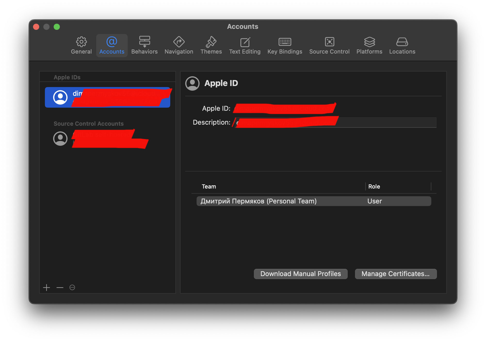

# Методические указания по выполнению задания для платформы iOS

## План

1. [Немного про SwiftUI](#немного-про-swiftui)
2. [Установка](#создание-проекта)
3. [Создание проекта](#создание-проекта)
4. [Структура проекта](#структура-проекта)
5. [Начало разработки UI](#начало-разработки-iu)

## Немного про SwiftUI
SwiftUI - это фреймворк для создания пользовательских интерфейсов на языке программирования Swift. Он был представлен Apple на конференции WWDC 2019 и стал альтернативой фреймворку UIKit для разработки интерфейсов iOS, macOS, watchOS и tvOS.

### Плюсы:

- Декларативный подход к построению интерфейса:

- SwiftUI предлагает декларативный стиль программирования, в отличие от императивного стиля, используемого в UIKit.
Вы описываете, как должен выглядеть интерфейс и как он должен вести себя, а SwiftUI берет на себя заботу о деталях реализации.
Обновление интерфейса в реальном времени:

- SwiftUI автоматически обновляет интерфейс при изменении данных. Если ваши данные изменяются, интерфейс обновляется автоматически без явного управления обновлением.
Оптимизированная работа с данными:

- SwiftUI предлагает удобные средства для работы с данными через @State, @Binding, и другие свойства.
Он упрощает управление состоянием приложения и обеспечивает эффективное взаимодействие с интерфейсом.
Кроссплатформенность:

- Одним из ключевых преимуществ SwiftUI является поддержка кроссплатформенной разработки. Вы можете использовать его для создания интерфейсов не только для iOS, но и для macOS, watchOS и tvOS.
Компактность кода:

- Код на SwiftUI часто оказывается более компактным и читаемым по сравнению с кодом на UIKit. Вы можете достичь того же результата с меньшим количеством строк кода.
Предпросмотр и отладка:

- SwiftUI предоставляет удобные инструменты предварительного просмотра интерфейса внутри самого кода, что облегчает процесс разработки и редактирования.

### Минусы:
- Ограниченная совместимость:

- На момент последних данных, SwiftUI поддерживает версии iOS 13.0+, macOS 10.15+, watchOS 6.0+ и tvOS 13.0+. Это означает, что если ваше приложение должно поддерживать более ранние версии операционных систем, вам придется прибегнуть к использованию UIKit или AppKit.

- Отсутствие полной функциональности: Некоторые функции, доступные в UIKit/AppKit, на момент введения SwiftUI, могут не иметь полной поддержки или отсутствовать вовсе. В некоторых случаях разработчики могут быть вынуждены использовать UIKit/AppKit для определенных задач.

- Ограниченная документация и опыта: Так как SwiftUI является более новым фреймворком, документация и опыт разработки могут быть менее обширными по сравнению с UIKit. Возможно, некоторые вопросы будут требовать дополнительного исследования.

- Сложности с кастомизацией: В некоторых случаях создание кастомных и сложных интерфейсов в SwiftUI может быть сложнее, чем в UIKit, так как фреймворк создан для простоты и декларативности.

- Вероятность изменений в будущем: Поскольку SwiftUI еще развивается, возможны изменения в API и функциональности. Это может повлечь за собой необходимость внесения изменений в код при обновлении версии SwiftUI.

Проще говоря, язык ещё молод, а большинство компний продолжают поддерживать многотысячные проекты на UIKit. Некоторые начинают миксовать UIKit со SwiftUI, но польностью отказаться от кита - дорого. Но SwiftUI уже пригоден для написания новых приложений.

## Установка

Отлично, а теперь приступим к разработке. Для начала нам понадобится XCode.
Зайти на [сайт](https://xcodereleases.com/) и открыть вкладку Releases. Найти Xcode, совместимый с вашим устройством. Или можно зайти в AppStore и скачать там Xcode. После установки Xcode необходимо зарегистрировать собственный AppleID для подписи приложения. Для этого открыть Xcode->Settings->Accounts, нажать на кнопку + и выбрать AppleID.


## Создание проекта
Открываем Xcode. Нажимаем `Create New Project`. 


Выбираем iOS и App.


Product Name – указать название разрабатываемого приложения. Team – выбрать добавленный ранее AppleID. Organization Identifier – индификатор вашей организации. Т.к это ЛР, я задам свой гитхаб, можете задать что пожелаете в обратном порядке. Bundle Identifier конфигурируется автоматически, менять его не нужно. Interface – SwiftUI. Language: Swift Снимаем галочки с полей Core Data и Include Tests. Нажать Next.


Готово, приложение создано.


## Структура проекта

Для того, чтобы в проекте была удобная и понятная навигация между файлами – необходимо научиться грамотно создавать структуру папок, по которым будем раскладывать файлы с кодом для наших экранов, запросов в сеть и прочего. Для того, чтобы создать новую папку – необходимо кликнуть правой кнопки мыши по папки, в который вы хотите создать новую и выбрать пункт New Group.
(Или command + option)


Файлы `iTunesApplicationApp.swift` и `Assets.xcassets` поместим в группу `Application`, а также создадим группу `Extenstions` и `Screens`

- Extenstions - здесь мы будем добавлять наши расширения. Подробнее про это поговорим дальше. Форма файлов будет следующим: `Name+Extenstions`. Например для структы String: `String+Extenstions`
- Screens - Это наши экраны

XCode автоматически сгенерировал нам `ContentView`. Это наш главный экран. В дальнейшем мы его переименуем. Что имеем сейчас:


## Начало разработки UI

Ранее мы познакомились с паттерном программировния MVC. Да, он великолепен для новичка, всё в одном месте, всё удобно. Но поддерживать такой код невозможно. В одном файле у нас образуется вёрстка, бизнеслогика и прочие вещи и поддерживать этот код... Поэтому сегодня мы рассмотрим похожий на MVC пыттер `MVVM`.

MVVM (Model-View-ViewModel) - это элегантный паттерн проектирования, утонченный и сбалансированный, специально разработанный для современной разработки программного обеспечения. Он предоставляет эффективный метод организации кода, разделяя его на три ключевых компонента: Model (Модель), View (Представление) и ViewModel (Модель представления).

Модель (Model): Отвечает за хранение данных и бизнес-логику приложения. Модель независима от пользовательского интерфейса и предоставляет единый источник данных.

Представление (View): Отвечает за отображение данных и взаимодействие с пользователем. Однако, в отличие от MVC, представление в MVVM более пассивно и не содержит логику обработки пользовательского ввода.

Модель представления (ViewModel): Это промежуточное звено между Моделью и Представлением. ViewModel отвечает за предоставление данных, необходимых для отображения в Представлении, и обрабатывает логику взаимодействия с пользователем. Он уменьшает связь между Моделью и Представлением, делая код более поддерживаемым и тестируемым.

MVVM обеспечивает отличную разделенность ответственности, повышенную переиспользуемость кода и легкость в тестировании. В отличие от MVC, MVVM часто используется в современных фреймворках, таких как SwiftUI и Combine, что делает его актуальным и востребованным в современной разработке программного обеспечения.

### Extenstions

Что же такое extension? Это просто расширение нашего класса. Т.е это то же самое, если бы мы писали всё в одном теле класса. А так мы разбиваем код на логические блоки. Можем даже создавать отдельный файл и там прописывать расширения.

Добавим файлы `Color+Extenstions.swift` и `LinearGradient+Extenstions.swift`

```swift
//
//  LinearGradient+Extenstions.swift
//  iTunesApplication
//
//  Created by Dmitriy Permyakov on 16/11/2023.
//

import SwiftUI

extension LinearGradient {

    static let appBackground = LinearGradient(
        colors: [.black, .pink],
        startPoint: .topLeading,
        endPoint: .bottomTrailing
    )

    static let appBackgroundViolet = LinearGradient(
        colors: [.black, .purple],
        startPoint: .topLeading,
        endPoint: .bottomTrailing
    )
}
```
```swift
//
//  Color+Extenstions.swift
//  iTunesApplicatio
//
//  Created by Dmitriy Permyakov on 15/11/2023.
//

import SwiftUI

extension Color {

    static let appBackground = Color(red: 33/255, green: 22/255, blue: 71/255)
    static let searchBarBackground = Color(red: 28/255, green: 23/255, blue: 36/255, opacity: 1)
    static let shimmerColor = Color.searchBarBackground
    static let appForeground = Color.white
}
```
Тут мы просто добавили цвета, который будем использовать в приложении.

### Вёрстка

А теперь давайте приступим к коду. Давайте рассмотрим конечный результат и подумаем, какие компоненты нам понядобятся. 

...................

На главном экране мы видим список треков. Значит нам надо будет сверстать ячейку. Назовём её `MusicCell`. Главный экран мы назовём `SongList`. Для этого нам придётся переименовать дэфолтный `ContentView`. Есть два способа.
1. Мы ручками меняем везде `ContentView` на `SongList`. 
2. Зажимаем правой кнопкой структурку, которую хотим переименовать и выбираем Refactor->Rename


и даём название `SongList`


И важно подменить про файл `iTunesApplicationApp.swift`:
Это точка входа в наше приложение. Здесь мы задаём экран, который будет открываться первым. У нас это `SongList`


А теперь давайте приступим за разработку главного экрана `SongList`. Подготовим всю иерархию под MVVM.
В группе Sreens добавим группу `MainScreen` и в ней добавим ещё группы `SongList` и `SongDetails`.

- SongList - Список наших ячеек.
- SongDetails - Экран подробнее. 

Сейчас мы занимаеся `SongList`. Добавим группы Model ViewModel View
Что имеем:


Далее добавим файлы в группы. В Model и ViewMode добавим `Swift File` а во View добавим `SwiftUI View`

Чтобы создать файлы, жмёшь command + N где хотим добавить и выбираем файл.


Вот что получили:


### SongModel
SongModel - это наша модель данных.
```swift
//
//  SongModel.swift
//  iTunesApplication
//
//  Created by Dmitriy Permyakov on 15/11/2023.
//

import Foundation

struct SongModel: Identifiable {
    let id = UUID()
    var trackId: Int
    var title: String?
    var artist: String?
    var imageURL: URL?
    var releaseDate: String?
    var collectionPrice: String?
}

// MARK: - Mock data

/// Это наши моки для вёрстки для SongModel
extension SongModel {

    static let mockData = SongModel(
        trackId: 10023,
        title: "Back To Her Men Back To Her Men",
        artist: "Demien Rice",
        imageURL: .mockData
    )
}

/// Это наши моки для вёрстки для массива SongModel
extension [SongModel] {

    static let mockData = (1...20).map {
        SongModel(
            trackId: $0,
            title: "Просто заголовок песни \($0)",
            artist: "Великий артист \($0)",
            imageURL: .mockData,
            releaseDate: "\($0)/11/2023",
            collectionPrice: $0 % 2 == 0 ? nil : "\($0)"
        )
    }
}

/// Это наши мок фото из интернета.
private extension URL {

    static let mockData = URL(string: "https://static.wixstatic.com/media/5a922b_6cd50e8a382c42bd9660cadc04bae1cd~mv2_d_2000_2000_s_2.jpg")
}
```
Тут мы подписали нашу модель на протокол `Identifiable`. Что такое протокол? Те же интерфейсы. Т.е это место, где мы прописываем, что должен реализовать наш subscriber, чтобы ему соответствовать. Для этого мы добавили поле `let id = UUID()`

Теперь про `String?`. Что же это такое? Это опциальная переменная. Т.е мы говорим, что ожидаем или строку, или nil. И далее мы всегда будем расспаковывать переменную. Есть три виды распаковки:

Первый способ:
```swift
let song = SongModel(trackId: 100, title: "Заголовок")
/// Здесь мы распаковываем наш заголовок и если он не nil, то попадаем во внутрь. иначе просто продём дальше
if let title = song.title {
    print(title)
}
```
Второй способ:
```swift
let song = SongModel(trackId: 100, title: "Заголовок")
/// Тут мы задаём дэфолт значение. Т.е если есть заголовок, мы выводим его, если нет, выводим заданную строку
print(song.title ?? "Заголовок не задан")
```
Третий способ:
Используя guard. Это как if, но наоборот. Т.е мы говорим, если не получилось распаковать переменную, выходим из функции, иначе идём дальше
```swift
func someFunction(song: SongModel) {
        guard let title = song.title else { return }
        print(title)
}
```

### MainViewModel

ObservableObject - это протокол в SwiftUI и Combine, который используется для создания объектов, способных уведомлять своих подписчиков (например, представлений) об изменениях своего состояния. Этот протокол является ключевым элементом реактивного программирования в SwiftUI и играет важную роль в реализации паттерна MVVM (Model-View-ViewModel).

Когда тип объекта подписан на ObservableObject, вы можете использовать публикуемые свойства (@Published) для автоматической генерации уведомлений о изменениях свойств. Когда изменяется значение публикуемого свойства, SwiftUI автоматически оповещает представления, зависящие от этого свойства, чтобы они обновили свой интерфейс.

Проще говоря, у нас есть куча разных экранов и все они должны перекидывать данные друг другу. А так мы создаём один класс и просто обращаемся к нему в разных экранах.
```swift
import Foundation

/// Это наш собственный протокол, в котором мы будем прописывать функции, которые мы должны реализовать дальше. Например, пользователь нажал на кнопку лайка. Тогда мы добавим func tapLike(id: Int)
protocol MainViewModelProtocol {
    func seachTracks(searchText: String) -> [SongModel]
    func pressedLike(trackID: Int, isLiked: Bool, completion: (() -> Void)?)
}

/// Это наш основной класс, который будет хранить все треки, полученные из АПИ.
/// Слово final говорит, что это конечный класс и наследоваться от него мы не будем
final class MainViewModel: ObservableObject {

    @Published var songs: [SongModel] = []
}

// MARK: - MainViewModelProtocol

/// Подписываемся на наш протокл, где в дальнейшем будем реализовывать функции
extension MainViewModel: MainViewModelProtocol {

    /// Фильтрация при поиске
    /// - Parameter searchText: текст из сёрч бара
    /// - Returns: массив отфильтрованных песен
    func seachTracks(searchText: String) -> [SongModel] {
        searchText.isEmpty
        ? songs
        : songs.filter {
            ($0.title ?? "Название не указано").contains(searchText)
            || ($0.artist ?? "Исполнитель не задан").contains(searchText)
        }
    }
    
    /// Нажатие кнопки лайка у ячейки
    /// - Parameters:
    ///   - trackID: `id` нажатого трека
    ///   - isLiked: статус лайка
    func pressedLike(trackID: Int, isLiked: Bool, completion: (() -> Void)? = nil) {
        print("Вы нажали трек с id: \(trackID). Статус: \(isLiked)")

        // Дальше пишите бизнес логику ...
        
        /// Здесь мы делаем имитацию запроса в интернет, т.е задержку на 1 секунду.
        DispatchQueue.main.asyncAfter(deadline: .now() + 1) {
            completion?()
        }
    }
}
```

### MusicCell
Начнём вёрстку нашей ячейки.
HStack - это стек. Всё, что мы сюда кладём, он размещает по горизонтали. По умолчанию центрирует.

Вот перечень всех параметров. 
```swift
HStack(alignment: .center, spacing: nil, content: {
    Text("Hello")
})
```
Запись можно сократить до вида
```swift
HStack {
    Text("Hello")
}
```
Также есть `ZStack` и `VStack`. ZStack - это наслоение, т.е компоненты буду накладываться друг на друга. VStack - это вертикальный стэк, т.е будут друго под друга. 

AsyncImage - принимает url на фото и на выходе мы получаем наш img типа Image, placeholder - то, что видит пользователь, пока мы грузим image.

Text("Наш текст") - это наш текст

Spacer() в SwiftUI представляет собой простой модификатор, используемый для занимания пространства в макете. Он расширяет свое пространство до максимально возможного размера, осуществляя пружинистую автонастройку, и может использоваться для равномерного распределения пространства между другими элементами внутри стека или контейнера.
Пример:
```swift
HStack {
    Text("text 1")
    Spacer()
    Text("text 2")
}
```
Тут мы получим Текст1 ________ Текст2. Т.е между ними будем невидимый пробел.

```swift
Button(action: {
    /// Логика при нажатии на кнопку
}, label: {
    Text("Button")
})
```
тут есть действие и лейбл. В лейбле может быть что угодно. У нас это текст. Так же можно сделать фото или HStack с фото и текстом. И так далее


`@State` - В SwiftUI, State представляет собой свойство, которое хранит и управляет изменяемым состоянием внутри представления. Использование State позволяет SwiftUI отслеживать изменения этого состояния и автоматически обновлять пользовательский интерфейс при его изменении.

`EnvironmentObject` в SwiftUI - это специальный тип объекта, который используется для передачи данных между различными представлениями в приложении. Он является частью паттерна проектирования "Observable Object" и позволяет создавать глобальные объекты, которые могут быть доступны из любой части приложения.
EnvironmentObject обычно используется для хранения состояния приложения, такого как пользовательские данные, настройки и другие глобальные переменные. Он позволяет избежать передачи данных через цепочку представлений и делает код более модульным и легким для поддержки.
Для использования EnvironmentObject в SwiftUI необходимо создать объект, который соответствует протоколу ObservableObject, и затем пометить его как EnvironmentObject в представлении с помощью модификатора @EnvironmentObject. Это позволяет представлению автоматически получать доступ к этому объекту из окружения и использовать его данные.


```swift
//
//  MusicCell.swift
//  iTunesApplication
//
//  Created by Dmitriy Permyakov on 15/11/2023.
//

import SwiftUI

struct MusicCell: View {

    @EnvironmentObject var viewModel: MainViewModel
    @State private var heartIsSelected = false
    var song: SongModel!
    
    /// Наша вьюха
    var body: some View {
        HStack {
            AsyncImage(url: song.imageURL) { img in
                img
                /// Говорим, что будем менять размеры фото
                    .resizable()
                /// Формат фото  ration - fill
                    .aspectRatio(contentMode: .fill)
                /// Задаём размер фото 100 на 100
                    .frame(width: 100, height: 100)
                /// Вырезаем фигуру RoundedRectangle с углами 20 градусов. Т.е просто делаем углы у нашего фото
                    .clipShape(RoundedRectangle(cornerRadius: 20))
            } placeholder: {
                ZStack {
                    /// Просто прямоугольник с углам 20
                    RoundedRectangle(cornerRadius: 20)
                    /// Это цвет прямоугольника. shimmerColor - наш кастомный цвет из файла `Color+Extenstions`
                        .fill(Color.shimmerColor)
                    /// Это наш лоудер, который крутится
                    ProgressView()
                }
                .frame(width: 100, height: 100)
            }

            VStack(spacing: 10) {
                Text(song.title ?? "Название не указано")
                /// Задаём фон текста
                    .font(.system(size: 20, weight: .semibold, design: .rounded))
                /// Тот же фрейм. Нам надо центрировать текст по левой стороне. Т.е делаем ширину infinity и выравнивание по левой части
                    .frame(maxWidth: .infinity, alignment: .leading)
                /// Выравнивание многострочного текста
                    .multilineTextAlignment(.leading)
                /// Цвет текста из `Color+Extenstions`
                    .foregroundStyle(Color.appForeground)
                /// Ограничение числа строк. `0` - это неограниченно, 1 - это одна. 2 - две и тд
                    .lineLimit(2)
                Text(song.artist ?? "Исполнитель не задан")
                    .font(.system(size: 16, weight: .semibold, design: .rounded))
                    .frame(maxWidth: .infinity, alignment: .leading)
                    .foregroundStyle(Color.appForeground.opacity(0.4))
                    .lineLimit(1)
            }
            /// Это наш отступ по горизонтали
            .padding(.horizontal, 5)

            Spacer()

            Button {
                heartIsSelected.toggle()
                viewModel.pressedLike(
                    trackID: song.trackId,
                    isLiked: heartIsSelected
                ) {
                    print("Данные записаны в БД!")
                }

            } label: {
                Image(systemName: heartIsSelected ? "suit.heart.fill" : "suit.heart")
                    .resizable()
                    .aspectRatio(contentMode: .fit)
                    .frame(width: 22, height: 22)
                /// Задаём цвет нашего изображения
                    .foregroundStyle(Color.appForeground)
            }
        }
        /// Наш EnvironmentObject var viewModel: MainViewModel
        .environmentObject(viewModel)
    }
}

// MARK: - Preview

/// Это наше превью, которая создаём экран справа
#Preview {
    /// .mockData - наш мок данных для превью справа
    MusicCell(song: .mockData)
        .padding()
    /// Важно! Без этого не будет работать превью. Будет крашится
        .environmentObject(MainViewModel())
    /// Задаём задний фон, используя градиент
        .background(LinearGradient.appBackground)
}
```


### SongList

@StateObject - это еще один специальный модификатор в SwiftUI, который используется для создания и хранения экземпляра ObservableObject в представлении. Он похож на @ObservedObject, но с одним отличием: @StateObject создает новый экземпляр ObservableObject только один раз при первом использовании представления, и затем сохраняет его состояние в течение жизни представления.

Это особенно полезно, когда нам нужно создать экземпляр ObservableObject в представлении и гарантировать, что он будет сохранять свое состояние при пересоздании представления (например, при обновлении данных или изменении ориентации устройства).

Для использования @StateObject в SwiftUI необходимо создать свойство в представлении с аннотацией @StateObject и присвоить ему новый экземпляр ObservableObject. Далее можно использовать это свойство для доступа к данным и методам ObservableObject в представлении.


```swift
//
//  SongList.swift
//  iTunesApplication
//
//  Created by Dmitriy Permyakov on 15/11/2023.
//

import SwiftUI

struct SongList: View {

    @StateObject private var viewModel = MainViewModel()
    @State private var searchBarText = ""
    private var filteredSongs: [SongModel] {
        viewModel.seachTracks(searchText: searchBarText)
    }

    var body: some View {
        /// Навигация нашего приложения, чтобы мы могли вернуться к экрану
        NavigationStack {
            /// Скролл вью, чтобы могли скролить
            ScrollView(showsIndicators: false) {
                /// То же самое, что и VStack, но он ленивый. Т.е переиспользует ячейки. Используеют, когда данных много.
                LazyVStack {
                    /// Тут перебираем наши треки. Т.к SongModel подписан на `Identifiable` мы можем по нему итерироваться.
                    ForEach(filteredSongs) { song in
                        /// Это место, куда мы будем переходить при нажатии
                        NavigationLink {
                            /// Экран, который откроем при нажатии
                            SongDetails(song: song)
                        } label: {
                            /// наша ячейка
                            MusicCell(song: song)
                        }
                        .padding(.bottom)
                    }
                    .padding(.horizontal, 15)
                }
            }
            /// Фон
            .background(LinearGradient.appBackground)
            /// Наш сёрч бар выше
            .searchable(text: $searchBarText)
            /// Наш заголовок
            .navigationBarTitle("Песни")
        }
        /// Не теряем!
        .environmentObject(viewModel)
        /// Задаём тему всегда тёмную
        .colorScheme(.dark)
        /// Перед появлением экрана будем выполнять функцию fetchData
        .onAppear(perform: fetchData)
    }
}

// MARK: - Network

private extension SongList {

    func fetchData() {
        viewModel.songs = .mockData
    }
}

// MARK: - Preview

#Preview {
    SongList()
    /// Не теряем!
        .environmentObject(MainViewModel())
}
```


### SongDetails

GeometryReader - это специальное представление в SwiftUI, которое позволяет получить информацию о геометрии родительского представления и использовать эту информацию для размещения и настройки дочерних представлений.

GeometryReader возвращает представление, которое занимает все доступное пространство в родительском представлении и предоставляет информацию о его размерах, координатах и прочих геометрических параметрах. Эта информация может быть использована для создания адаптивного и отзывчивого дизайна, например, для размещения дочерних представлений в определенном месте или с определенными размерами в зависимости от размеров родительского представления.

Для использования GeometryReader достаточно включить его в иерархию представлений и использовать полученную информацию о геометрии для настройки дочерних представлений. Это представление особенно полезно при создании динамических макетов, адаптированных под разные размеры экранов и ориентации устройств.


```swift
//
//  SongDetails.swift
//  iTunesApplication
//
//  Created by Dmitriy Permyakov on 16/11/2023.
//

import SwiftUI

struct SongDetails: View {
    @EnvironmentObject var viewModel: MainViewModel
    var song: SongModel!

    var body: some View {
        GeometryReader {
            let size = $0.size
            ScrollView {
                VStack {
                    ImageView(size)

                    SongTextInfo
                        .padding()
                }
            }
        }
        .padding(.horizontal)
        .environmentObject(viewModel)
        .navigationBarTitle("", displayMode: .inline)
        .colorScheme(.dark)
        .background(LinearGradient.appBackgroundViolet)
    }
}

// MARK: - SongDetails

private extension SongDetails {
    
    /// Вьюха картинки
    /// - Parameter size: размер фото
    /// - Returns: кастомную фотку
    func ImageView(_ size: CGSize) -> some View {
        AsyncImage(url: song.imageURL) { img in
            img
                .resizable()
                .aspectRatio(contentMode: .fill)
                .frame(width: size.width, height: size.width)
                .clipShape(RoundedRectangle(cornerRadius: 20))

        } placeholder: {
            ZStack {
                RoundedRectangle(cornerRadius: 20)
                    .fill(Color.shimmerColor)
                ProgressView()
            }
            .frame(width: size.width, height: size.width)
        }
    }
    
    /// Наше тело со всей текстой информацией
    var SongTextInfo: some View {
        VStack {
            if let releaseDate = song.releaseDate {
                Text(releaseDate)
                    .font(.caption)
                    .frame(maxWidth: .infinity, alignment: .leading)
                    .foregroundStyle(.secondary)
                    .padding(.bottom)
            }

            Text(song.title ?? "Название не указано")
                .frame(maxWidth: .infinity, alignment: .leading)
                .font(.system(size: 22, weight: .semibold, design: .rounded))

            Text(song.artist ?? "Исполнитель не задан")
                .frame(maxWidth: .infinity, alignment: .leading)
                .font(.system(size: 18, weight: .semibold, design: .rounded))
                .foregroundStyle(.secondary)

            HStack {
                Text("Цена")
                    .font(.system(size: 20, weight: .semibold, design: .rounded))
                Spacer()

                /// Если цена задана, то выводим её, иначе слово `Бесплатно`
                if let collectionPrice = song.collectionPrice {
                    Text(collectionPrice + " $")
                        .font(.system(size: 25, weight: .bold, design: .rounded))
                        .frame(maxWidth: .infinity, alignment: .trailing)
                } else {
                    Text("Бесплатно")
                        .font(.system(size: 20, weight: .bold, design: .rounded))
                        .frame(maxWidth: .infinity, alignment: .trailing)
                }
            }
            .padding(.top, 50)
        }
    }
}

// MARK: - Preview

#Preview {
    NavigationStack {
        SongDetails(song: .mockData)
    }
    .environmentObject(MainViewModel())
}
```


Отлично, наше приложение готово. Осталось только написать апишный сервис. Пока проект выглядит так:


